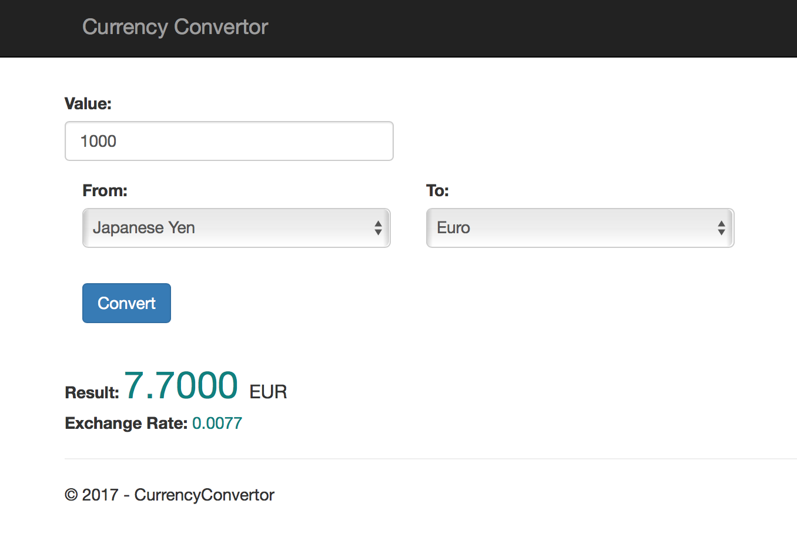

# Currency Convertor - ASP.NET Core

###### User Guide
---
#### Table of Contents

1. [Application installation](#installation)
2. [Using and modifying the application](#modifying)
2. [Screen Shots](#screen)


## 1. Application installation <a name="installation"></a>


### 1.1 Setting up the development environment 

If you’re using MacOs, please follow this page to set up your development environment:
[https://docs.microsoft.com/en-us/aspnet/core/tutorials/first-mvc-app-xplat/start-mvc](https://docs.microsoft.com/en-us/aspnet/core/tutorials/first-mvc-app-xplat/start-mvc)

If you’re using Windows, please follow this page:
[https://docs.microsoft.com/en-us/aspnet/core/tutorials/first-mvc-app/start-mvc](https://docs.microsoft.com/en-us/aspnet/core/tutorials/first-mvc-app/start-mvc)


### 1.2 Build and run the application

Once ASP.NET core environment is installed on you computer, restore the dependencies and build the project like following:

__MacOs users__:

```
cd "ThumbnailCreator"
dotnet restore
dotnet build (optional, build will also happen with it's run)
dotnet run
```

__Windows users__:

Tap F5 to run the app in debug mode or Ctrl-F5 in non-debug mode.


## 2. Using and modifying the application<a name="modifying"></a>


### 2.1 Using the application

To use the currency convertor application, simply enter the value you want **convert** button.


### 2.2 Architecture explanation for code modification / re-use

The application is based on a simple Model View Component architecture:

The models: *Models\Currency*, contains the main model (currencyModel) that contains the exchange rate, country codes, and values.
The country code dictionary is build from the *wwwroot/res/Currency.json* file.

The view: *Views\Home\Index.cshtml*, contains Html view.

The Controller: *Controllers\HomeControler.cs* contains the logic that convert the *Currency.json* file to a dictionary, and the call to the Yahoo API to get the current exchange rate.


## 2. Screen Shots<a name="screen"></a>



---
